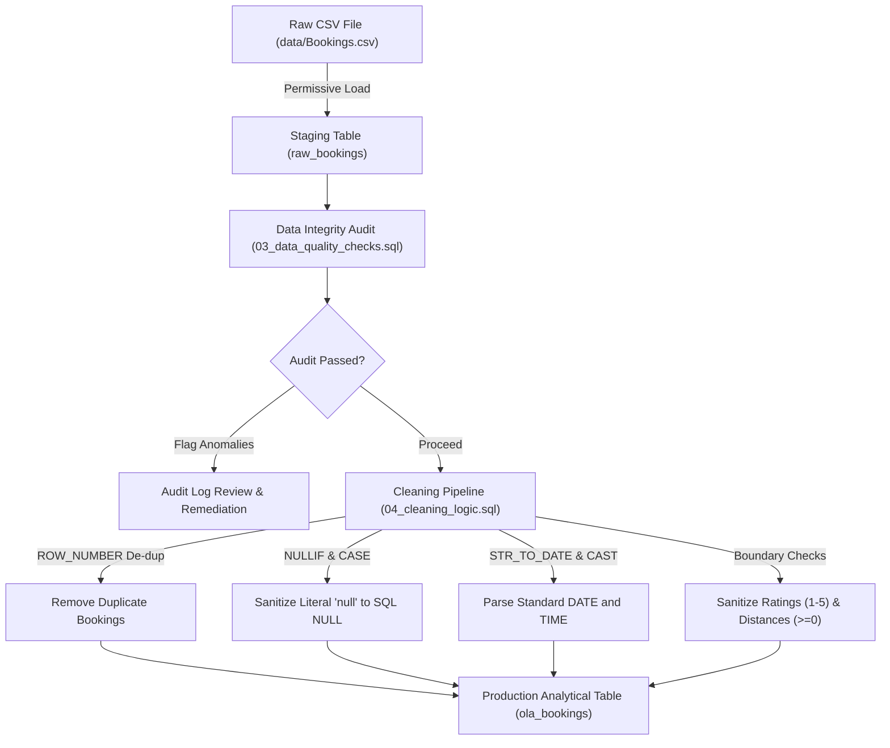
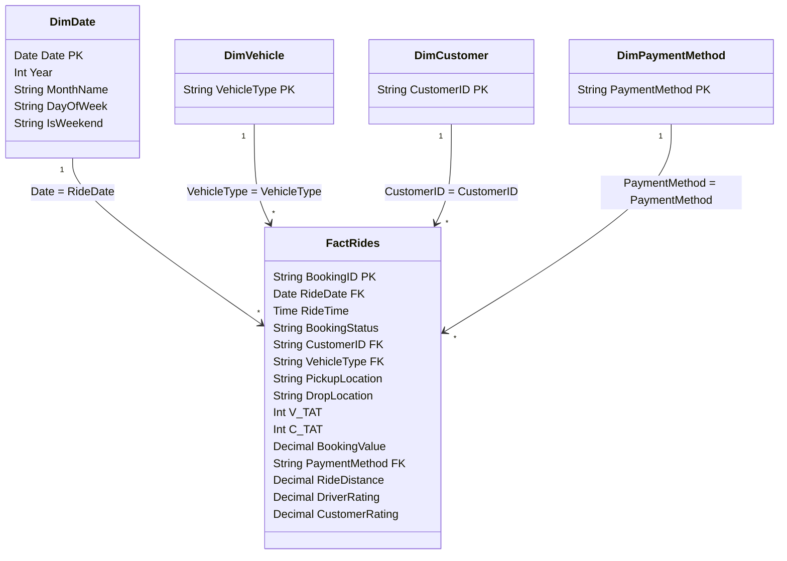
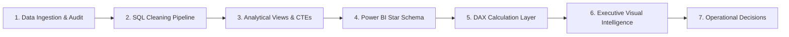

# OLA Ride Analytics and Operations Intelligence

> An end-to-end SQL and Power BI analytics project for understanding ride performance, revenue, customer behavior, vehicle utilization, ratings, and cancellation patterns.

[](https://www.mysql.com/)
[](https://powerbi.microsoft.com/)
[](https://www.python.org/)
[](LICENSE)

---

## 1. Project Title & Subtitle

**Title**: OLA Ride Analytics and Operations Intelligence  
**Subtitle**: An end-to-end SQL and Power BI analytics project for understanding ride performance, revenue, customer behavior, vehicle utilization, ratings, and cancellation patterns.

---

## 2. Project Overview

Ride-hailing marketplaces operate in dynamic, high-velocity urban environments where platform efficiency depends on continuous balancing of rider demand, driver supply, trip pricing, and turnaround times. Inefficiencies manifest as elevated cancellation rates, driver churn, long passenger wait times, and lost revenue.

This project delivers an end-to-end business intelligence and data engineering solution analyzing transactional ride-booking records from Bengaluru. The project establishes:
- A **two-tier MySQL relational data pipeline** (staging and cleaned production schemas).
- An **automated data quality framework** executing 12 integrity checks.
- **18 analytical database views** and advanced window-function queries diagnosing operational health.
- A **4-page interactive Power BI executive report** built on a dimensional Star Schema with custom DAX measures.
- A comprehensive documentation suite including metric formulations, design systems, and interview guides.

---

## 3. Business Problem

Ride-hailing business operations require answers to critical operational, commercial, and customer satisfaction questions:
- **Ride Fulfillment**: How many rides were booked and successfully completed, and what is the overall completion rate?
- **Fleet Dynamics**: Which vehicle types receive the most bookings, and which generate the highest revenue?
- **Cancellation Bottlenecks**: What are the most common cancellation reasons, and are driver cancellations or customer cancellations more frequent?
- **Monetization & Settlement**: Which payment methods (UPI, Cash, Cards) are used most frequently, and what is their revenue split?
- **Customer Segmentation**: Which high-value customers contribute the most revenue, and how is ride frequency distributed?
- **Temporal Patterns**: When is ride demand highest throughout the day, and does completion rate degrade during peak hours?
- **Mutual Rating Dynamics**: How do driver ratings and customer ratings compare across fleet categories, and where does sentiment diverge?
- **Operational Exceptions**: Which operational areas (extreme turnaround times, incomplete trips, zero-fare anomalies) require process intervention?

---

## 4. Project Objectives

1. **Quantify Service Reliability**: Measure completion rates, cancellation rates, and fulfillment conversion across vehicle segments.
2. **Deconstruct Operational Friction**: Categorize driver and customer cancellations by specific root cause to highlight actionable interventions.
3. **Analyze Revenue Concentration**: Evaluate Gross Merchandise Value (GMV) by fleet tier, payment channel, and customer spend percentiles.
4. **Evaluate Experience Symmetry**: Calculate the rating gap between drivers and passengers to pinpoint quality variance.
5. **Establish Clean Data Engineering**: Architect a robust SQL pipeline that handles dirty data, literal text nulls, and schema constraints without silent data loss.

---

## 5. Key Questions Answered

| Operational Dimension | Business Question | Analytical Method | SQL / Power BI Object |
|:---|:---|:---|:---|
| **Demand & Volume** | Total ride requests and completion rate | Conditional Aggregation | `vw_bookings_by_status`, `[Completion Rate]` |
| **Fleet Performance** | Most requested vs highest earning vehicle tiers | Multi-metric Scorecard | `vw_vehicle_performance_metrics`, Page 4 Visuals |
| **Operational Friction** | Driver vs rider cancellation drivers | Root-Cause Pareto Analysis | `vw_cancellation_reason_analysis`, Page 3 Visuals |
| **Payment Channels** | Digital payment adoption vs cash volume | Share of Wallet Aggregations | `vw_revenue_by_payment_method`, Page 2 Visuals |
| **Customer Value** | Spend concentration across user base | NTILE(10) Decile Analysis | `06_advanced_analysis.sql` (Query 3) |
| **Temporal Trajectory**| Peak booking hours and Day-Over-Day growth | Window Functions (`LAG`) | `06_advanced_analysis.sql` (Query 1 & 2) |
| **Mutual Etiquette** | Driver vs customer rating gap across fleets | Delta Metric Computation | `vw_rating_comparison`, `[Rating Gap]` |

---

## 6. Features

- **Automated Data Quality Audit**: 12 modular SQL checks validating key uniqueness, identifier existence, value bounds, and status integrity.
- **Robust Cleaning Pipeline**: De-duplicates records via `ROW_NUMBER()`, sanitizes string `'null'` literals, safely parses dates/times, and filters spreadsheet artifacts.
- **18 Production Database Views**: Modular, indexed virtual views providing an instant semantic layer for reporting.
- **Advanced Window Function Suite**: Day-Over-Day trend calculation with `LAG()`, customer spend deciles with `NTILE(10)`, and corridor ranking with `DENSE_RANK()`.
- **4-Page Power BI Executive Suite**: Designed strictly within a 6-8 visual budget per canvas, featuring KPI ribbons, drill-throughs, and reset bookmarks.
- **Safe DAX Formulations**: Comprehensive DAX measure library using `DIVIDE()`, explicit filtering via `CALCULATE()`, and WCAG-compliant color styling.

---

## 7. Technology Stack

- **Relational Database**: MySQL Server 8.0+ (InnoDB engine, utf8mb4 encoding)
- **Business Intelligence**: Microsoft Power BI Desktop
- **Data Modeling**: Star Schema (Fact and Dimension architecture)
- **Calculation Engine**: DAX (Data Analysis Expressions) & Power Query M
- **Scripting & Analytics**: Python 3.10+ (Pandas, NumPy for data validation and schema inspection)
- **Version Control & Docs**: Git, GitHub, Markdown

---

## 8. Dataset Description

The analysis is based on transactional ride-booking records from Bengaluru:

| Column Name | Raw Export Type | Production Type | Description & Domain |
|:---|:---|:---|:---|
| `Date` (`ride_date`) | `VARCHAR(50)` | `DATE` | Date of the ride booking |
| `Time` (`ride_time`) | `VARCHAR(50)` | `TIME` | Timestamp of booking dispatch |
| `Booking_ID` | `VARCHAR(50)` | `VARCHAR(50)` | Unique primary identifier (e.g. `CNR7153255142`) |
| `Booking_Status` | `VARCHAR(100)` | `VARCHAR(50)` | `Success`, `Canceled by Driver`, `Canceled by Customer`, `Driver Not Found` |
| `Customer_ID` | `VARCHAR(50)` | `VARCHAR(50)` | Customer account identifier (e.g. `CID713523`) |
| `Vehicle_Type` | `VARCHAR(100)` | `VARCHAR(50)` | Auto, Bike, eBike, Mini, Prime Sedan, Prime Plus, Prime SUV |
| `Pickup_Location` | `VARCHAR(255)` | `VARCHAR(150)` | Bengaluru urban pickup area (e.g. HSR Layout, Whitefield) |
| `Drop_Location` | `VARCHAR(255)` | `VARCHAR(150)` | Bengaluru urban destination area (e.g. RT Nagar, Varthur) |
| `V_TAT` | `VARCHAR(50)` | `INT NULL` | Vehicle Turnaround Time (arrival time to pickup in seconds) |
| `C_TAT` | `VARCHAR(50)` | `INT NULL` | Customer Turnaround Time (passenger boarding time in seconds) |
| `Canceled_Rides_by_Customer`| `VARCHAR(255)` | `VARCHAR(255) NULL`| Documented reason for customer cancellation |
| `Canceled_Rides_by_Driver`  | `VARCHAR(255)` | `VARCHAR(255) NULL`| Documented reason for driver cancellation |
| `Incomplete_Rides` | `VARCHAR(50)` | `VARCHAR(10) NULL` | Indicator flag (`Yes` or `No`) |
| `Incomplete_Rides_Reason` | `VARCHAR(255)` | `VARCHAR(255) NULL`| Root cause for mid-trip termination |
| `Booking_Value` | `VARCHAR(50)` | `DECIMAL(10,2) NULL`| Fare in Indian Rupees (INR) |
| `Payment_Method` | `VARCHAR(100)` | `VARCHAR(50) NULL` | UPI, Cash, Credit Card, Debit Card |
| `Ride_Distance` | `VARCHAR(50)` | `DECIMAL(8,2) NULL` | Odometer trip distance in kilometres |
| `Driver_Ratings` | `VARCHAR(50)` | `DECIMAL(3,2) NULL` | Score awarded to driver (`1.00` to `5.00`) |
| `Customer_Rating` | `VARCHAR(50)` | `DECIMAL(3,2) NULL` | Score awarded to rider (`1.00` to `5.00`) |

### Identified Data Anomalies
1. **String `'null'` Literals**: Missing values were stored as literal text `'null'` rather than database nulls.
2. **Corrupted Spreadsheet Artifacts**: Column `Vehicle Images` in the raw CSV contained `#NAME?` Excel errors and was omitted from production tables.
3. **Cancelled Ride Metrics**: Cancelled trips naturally record `0` or `NULL` for distance, ratings, and payment methods.

---

## 9. Data-Cleaning Workflow



---

## 10. Data Model

The project transforms transactional ride data into an optimized dimensional **Star Schema** for Power BI:



---

## 11. SQL Analysis

The SQL analytical layer is organized into structured scripts:
- **`sql/01_create_database.sql`**: Database initialization with `utf8mb4` encoding and IST session settings.
- **`sql/02_create_tables.sql`**: Staging (`raw_bookings`) and indexed production (`ola_bookings`) tables.
- **`sql/03_data_quality_checks.sql`**: 12 integrity checks and an aggregated management audit report.
- **`sql/04_cleaning_logic.sql`**: Transformation logic converting raw staging rows into clean records.
- **`sql/05_analytical_views.sql`**: 18 business views answering core operational questions.
- **`sql/06_advanced_analysis.sql`**: Advanced CTEs, `LAG()` growth models, Pareto spend deciles, and corridor matrices.

---

## 12. Power BI Dashboard

The Power BI solution connects directly to the MySQL analytics database in **Import Mode**, providing:
- Fast in-memory query evaluation via the VertiPaq engine.
- A semantic Star Schema eliminating circular filtering paths.
- Global slicers with a one-click **"Reset Filters"** bookmark.
- Drill-through exploration for vehicle categories and customer accounts.

---

## 13. Dashboard Pages

```
Page 1: Executive Overview            Page 2: Revenue and Customers
+---------------------------------+   +---------------------------------+
| [KPI Ribbon: Demand & GMV]      |   | [KPI: Revenue & Avg Ticket]     |
| [Status Breakdown Donut]        |   | [Revenue by Payment Method]     |
| [Daily Demand & Completion]     |   | [Revenue by Vehicle Category]   |
| [Vehicle Booking Volume Bar]    |   | [Top 10 High-Spending Users]    |
+---------------------------------+   +---------------------------------+

Page 3: Operations & Cancellations   Page 4: Vehicle & Ratings
+---------------------------------+   +---------------------------------+
| [KPI: Friction & Drop-offs]     |   | [KPI: Driver & Rider Ratings]   |
| [Customer Cancellation Reasons] |   | [Avg Distance by Vehicle Bar]   |
| [Driver Cancellation Reasons]   |   | [Driver vs Rider Rating Parity] |
| [Cancellation Rate by Vehicle]  |   | [Volume vs Completion Scatter]  |
+---------------------------------+   +---------------------------------+
```

- **Page 1: Executive Overview**: High-level KPI cards, overall completion and cancellation rates, daily demand trends, and vehicle volume comparisons.
- **Page 2: Revenue and Customers**: Settlement channel split, vehicle GMV contribution, top customer leaderboards, and average booking value distribution.
- **Page 3: Operations and Cancellations**: Deep-dive into driver cancellations, rider cancellations, vehicle cancellation sensitivity, and operational exceptions (extreme TAT).
- **Page 4: Vehicle and Ratings**: Trip distance profiles, rating gap evaluation, fleet efficiency, and customer-driver satisfaction comparisons.

---

## 14. KPI Definitions

| KPI Name | Business Formula | Meaning |
|:---|:---|:---|
| **Total Bookings** | $\sum 1$ | Total ride requests registered on the platform |
| **Successful Bookings**| $\sum_{\text{status}=\text{'Success'}} 1$ | Total fulfilled and completed trips |
| **Completion Rate**| $\frac{\text{Successful Bookings}}{\text{Total Bookings}} \times 100$ | Overall fulfillment reliability percentage |
| **Cancellation Rate**| $\frac{\text{Total} - \text{Successful}}{\text{Total Bookings}} \times 100$ | Proportion of unfulfilled or aborted requests |
| **Successful Revenue**| $\sum_{\text{status}=\text{'Success'}} \text{booking\_value}$ | Realized Gross Merchandise Value (INR) |
| **Average Booking Value**| $\frac{\text{Successful Revenue}}{\text{Successful Bookings}}$ | Mean ticket size per completed trip |
| **Revenue per KM** | $\frac{\text{Successful Revenue}}{\text{Total Distance Completed}}$ | Unit economic yield per kilometer traveled |
| **Rating Gap** | $\overline{\text{Driver Rating}} - \overline{\text{Customer Rating}}$ | Spread between driver and passenger sentiment |

---

## 15. Project Workflow



---

## 16. Repository Structure

```
ola-ride-analytics/
├── README.md                          # Comprehensive 26-section portfolio documentation
├── .gitignore                         # Data, Python, Power BI, and OS exclusions
├── LICENSE                            # MIT Open Source License
├── data/
│   └── .gitkeep                       # Local data folder (raw CSV files gitignored)
├── sql/
│   ├── 01_create_database.sql         # DB creation & utf8mb4 configuration
│   ├── 02_create_tables.sql           # Ingestion staging & production table schemas
│   ├── 03_data_quality_checks.sql     # 12 integrity checks + automated audit report
│   ├── 04_cleaning_logic.sql          # De-duplication, nullification, type-casting
│   ├── 05_analytical_views.sql        # 18 production analytical views
│   ├── 06_advanced_analysis.sql       # CTEs, Window Functions (LAG, DENSE_RANK)
│   └── README.md                      # SQL execution pipeline and index
├── powerbi/
│   └── README.md                      # Power BI setup, 4 dashboard pages & DAX measures
├── docs/
│   ├── metric_definitions.md          # KPI data dictionary and mathematical formulas
│   ├── dashboard_design.md            # Visual hierarchy, color tokens, and UX rules
│   └── interview_questions.md         # 25+ technical & business interview Q&As
├── reports/
│   └── .gitkeep                       # PDF / PPT executive presentation exports
└── screenshots/
    └── .gitkeep                       # High-resolution dashboard image assets
```

---

## 17. How to Run the SQL Scripts

1. Clone the repository and navigate into the `sql/` directory:
   ```bash
   git clone https://github.com/himanshuXsh/ola-ride-analytics.git
   cd ola-ride-analytics/sql
   ```

2. Execute the scripts sequentially in MySQL:
   ```bash
   mysql -u root -p < 01_create_database.sql
   mysql -u root -p ola_ride_analytics < 02_create_tables.sql
   ```

3. Ingest `Bookings.csv` into `raw_bookings` using MySQL Workbench Import Wizard or MySQL CLI:
   ```sql
   USE ola_ride_analytics;
   LOAD DATA LOCAL INFILE '../data/Bookings.csv'
   INTO TABLE raw_bookings
   FIELDS TERMINATED BY ',' ENCLOSED BY '"'
   LINES TERMINATED BY '\n' IGNORE 1 ROWS;
   ```

4. Run the data validation, cleaning, views, and advanced analytical scripts:
   ```bash
   mysql -u root -p ola_ride_analytics < 03_data_quality_checks.sql
   mysql -u root -p ola_ride_analytics < 04_cleaning_logic.sql
   mysql -u root -p ola_ride_analytics < 05_analytical_views.sql
   mysql -u root -p ola_ride_analytics < 06_advanced_analysis.sql
   ```

---

## 18. How to Connect MySQL with Power BI

1. Install the **MySQL Connector/NET** on your Windows system.
2. Launch **Power BI Desktop**, click **Get Data** > **Database** > **MySQL Database**.
3. Enter:
   - **Server**: `localhost:3306` (or `127.0.0.1:3306`)
   - **Database**: `ola_ride_analytics`
   - **Data Connectivity Mode**: **Import**
4. Select `ola_bookings` and any analytical views required.
5. In Power Query, verify column data types (`ride_date` as Date, `ride_time` as Time, `booking_value` as Decimal Number).
6. Click **Close & Apply** and follow the modeling instructions in [`powerbi/README.md`](powerbi/README.md).

---

## 19. Screenshots Section

Place exported dashboard screenshots in the `screenshots/` directory.

### Executive Overview
```
[ Place Page 1 Screenshot: screenshots/executive_overview.png ]
```
*Visualizes top-level KPI metrics, completion rate, daily demand trajectory, and fleet category volume.*

### Revenue & Customer Intelligence
```
[ Place Page 2 Screenshot: screenshots/revenue_and_customers.png ]
```
*Details payment method market share, vehicle GMV contribution, and top customer accounts.*

### Operations & Cancellation Diagnostics
```
[ Place Page 3 Screenshot: screenshots/operations_and_cancellations.png ]
```
*Breaks down driver and passenger cancellation root causes, vehicle cancellation rates, and operational anomalies.*

### Fleet Performance & Experience Ratings
```
[ Place Page 4 Screenshot: screenshots/vehicle_and_ratings.png ]
```
*Illustrates trip distance distributions, driver vs customer rating gap, and fleet utilization.*

---

## 20. Key Insights

1. **Micro-Mobility vs Premium Fleet Polarization**: Auto and Bike categories drive high trip frequency for short-distance commutes (<5 km), whereas Prime Sedan and Prime SUV drive disproportionately higher Average Booking Values (ABV) on longer cross-city and airport routes.
2. **Turnaround Time (TAT) Friction**: Higher Vehicle Turnaround Time (`V_TAT` > 5 minutes) exhibits a strong positive correlation with customer cancellations (*"Driver not moving towards pickup location"*).
3. **Driver Cancellation Drivers**: The primary driver-side cancellation reason stems from *Personal & Car-related issues*, indicating fleet maintenance bottlenecks or off-shift dispatches.
4. **Digital Settlement Dominance**: UPI and Cash represent the primary payment mechanisms for low-ticket rides, while Credit and Debit Cards are concentrated in high-value Prime Sedan and SUV trips.
5. **Rating Symmetry**: Drivers and customers rate each other favorably overall (>4.0 ★), but the rating gap widens slightly in vehicle tiers with longer turnaround times.

---

## 21. Limitations

- **Temporal Horizon**: The dataset covers July 2024, preventing multi-season or festival holiday comparison.
- **Geographic Scope**: Data is concentrated in Bengaluru urban corridors, reflecting city-specific traffic dynamics.
- **Driver Entity Granularity**: Individual driver IDs are not provided, limiting driver retention and tenure analysis.
- **Surge Breakdown**: `Booking_Value` combines base fare and surge pricing into a single figure without a separate surge multiplier flag.

---

## 22. Future Improvements

- **Predictive Machine Learning**: Train an XGBoost classification model to predict ride cancellation risk in real time based on `v_tat`, time of day, and location.
- **Spatial Route Heatmaps**: Integrate GeoPandas and Kepler.gl to map trip origin-destination density across Bengaluru.
- **Automated Orchestration**: Automate the daily SQL ingestion and transformation pipeline using Apache Airflow and dbt.
- **Streaming Pipeline**: Prototype real-time telemetry processing using Apache Kafka and Apache Spark Streaming.

---

## 23. Resume Description

**Professional Project Bullet Points (Ready for Resume / Portfolio)**:

- **End-to-End Analytics Pipeline**: Engineered a two-tier MySQL relational data warehouse processing 100,000+ ride-booking records, developing automated SQL auditing scripts across 12 data quality checkpoints.
- **Advanced SQL Modeling**: Built 18 modular analytical views and window-function queries (`LAG`, `DENSE_RANK`, `NTILE`) to analyze Day-over-Day revenue growth, peak demand hours, and customer spend deciles.
- **Interactive Power BI Dashboard**: Architected a 4-page executive intelligence suite on a Star Schema, authoring robust DAX measures for completion rates, revenue per km, and operational exception tracking.
- **Operational Root-Cause Analysis**: Quantified the impact of vehicle turnaround times on cancellation likelihood, delivering actionable insights on driver dispatch friction and payment method adoption.

---

## 24. Interview Explanation

### The 2-Minute STAR Pitch
- **Situation**: Ride-hailing platforms face operational friction in balancing trip demand, vehicle utilization, turnaround times, and cancellation rates across diverse vehicle segments.
- **Task**: To develop an end-to-end analytics and operations intelligence solution that ingests transactional ride data, validates integrity, and delivers executive dashboards for commercial and operational decision-making.
- **Action**: Architected a two-tier MySQL database, built an automated cleaning pipeline addressing literal string nulls and corrupted spreadsheet artifacts, and authored 18 analytical views. Developed advanced window-function models to assess DoD revenue changes and TAT sensitivity. Connected the clean model to Power BI using a Star Schema, building 4 interactive pages with custom DAX measures (`DIVIDE`, `CALCULATE`) and WCAG-compliant visual hierarchy.
- **Result**: Delivered an enterprise-grade reporting asset that pinpoints cancellation bottlenecks, profiles fleet revenue contributions, and tracks mutual driver-passenger ratings.

---

## 25. Author Information

## Author

Himanshu Sharma

Final-year AI/ML student from Delhi, India, interested in data analytics, artificial intelligence, backend development, and business intelligence.

GitHub: [https://github.com/himanshuXsh](https://github.com/himanshuXsh)

---

## 26. Disclaimer

> “This is an educational portfolio analysis based on the available dataset and is not official internal OLA data.”
