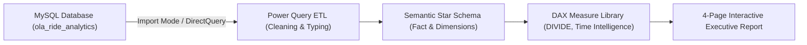
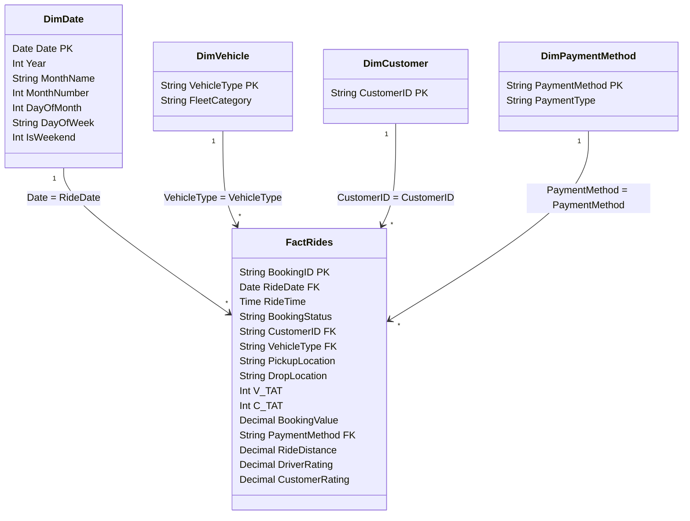

# Power BI Dashboard Architecture & Implementation Guide

This guide details the end-to-end design, semantic modeling, DAX measure suite, and visualization blueprint for the **OLA Ride Analytics and Operations Intelligence** Power BI report.

---

## Architecture & Workflow



---

## 1. Connecting MySQL to Power BI Desktop

### Prerequisites
1. Install **MySQL Connector/NET** (or MariaDB ODBC connector) compatible with your Windows system.
2. Ensure MySQL Server is running locally on port `3306`.

### Step-by-Step Connection Guide
1. Launch **Power BI Desktop**.
2. On the Home ribbon, select **Get Data** > **Database** > **MySQL Database**.
3. Enter connection settings:
   - **Server**: `127.0.0.1:3306` (or `localhost:3306`)
   - **Database**: `ola_ride_analytics`
   - **Data Connectivity Mode**: Select **Import** (recommended for fast visual rendering, caching, and full DAX time-intelligence support).
4. Enter your MySQL database credentials (Username: `root`, Password).
5. In the Navigator window, select the clean table `ola_bookings` and analytical views (e.g., `vw_successful_bookings`, `vw_vehicle_performance_metrics`).
6. Click **Transform Data** to open Power Query.

### Power Query Transformations & Validations
- Ensure `ride_date` is detected as **Date** type (`type date`).
- Ensure `ride_time` is detected as **Time** type (`type time`).
- Ensure `booking_value` and `ride_distance` are **Decimal Number** (`Currency` / `Fixed decimal`).
- Verify that `v_tat` and `c_tat` are **Whole Number**.
- Confirm that text fields (`booking_status`, `vehicle_type`, `payment_method`) have no trailing whitespace (Apply `Text.Trim`).
- Click **Close & Apply**.

---

## 2. Semantic Data Model (Star Schema)

Although the source table is denormalized (`ola_bookings`), best practice in Power BI is to create a clean **Star Schema** with dimension tables and a centralized fact table:



### Creating the Dedicated Date Dimension (DAX)
Under **Modeling** > **New Table**, create a dedicated calendar table:

```dax
DimDate = 
VAR MinDate = MIN(FactRides[ride_date])
VAR MaxDate = MAX(FactRides[ride_date])
RETURN
ADDCOLUMNS(
    CALENDAR(MinDate, MaxDate),
    "Year", YEAR([Date]),
    "MonthNumber", MONTH([Date]),
    "MonthName", FORMAT([Date], "MMMM"),
    "MonthShort", FORMAT([Date], "MMM"),
    "DayOfMonth", DAY([Date]),
    "DayOfWeek", FORMAT([Date], "dddd"),
    "DayOfWeekNumber", WEEKDAY([Date], 2),
    "IsWeekend", IF(WEEKDAY([Date], 2) IN {6, 7}, "Weekend", "Weekday")
)
```

---

## 3. Production DAX Measure Library

> [!IMPORTANT]
> Always use `DIVIDE(numerator, denominator, 0)` rather than `/` to gracefully avoid division-by-zero errors when filters return empty subsets. All rate measures must be explicitly formatted as **Percentage (`0.0%`)** in the Measure Tools ribbon.

### Core Volume & Completion Measures

```dax
-- 1. Total Bookings
Total Bookings = 
COUNTROWS(FactRides)
```

```dax
-- 2. Successful Bookings
Successful Bookings = 
CALCULATE(
    COUNTROWS(FactRides),
    FactRides[booking_status] = "Success"
)
```

```dax
-- 3. Completion Rate (%)
Completion Rate = 
DIVIDE(
    [Successful Bookings],
    [Total Bookings],
    0
)
```

```dax
-- 4. Cancelled Bookings
Cancelled Bookings = 
CALCULATE(
    COUNTROWS(FactRides),
    FactRides[booking_status] IN {"Canceled by Customer", "Canceled by Driver", "Driver Not Found"}
)
```

```dax
-- 5. Cancellation Rate (%)
Cancellation Rate = 
DIVIDE(
    [Cancelled Bookings],
    [Total Bookings],
    0
)
```

```dax
-- 6. Customer Cancellations
Customer Cancellations = 
CALCULATE(
    COUNTROWS(FactRides),
    FactRides[booking_status] = "Canceled by Customer"
)
```

```dax
-- 7. Driver Cancellations
Driver Cancellations = 
CALCULATE(
    COUNTROWS(FactRides),
    FactRides[booking_status] = "Canceled by Driver"
)
```

```dax
-- 8. Incomplete Rides Count
Incomplete Rides = 
CALCULATE(
    COUNTROWS(FactRides),
    FactRides[incomplete_rides] = "Yes"
)
```

---

### Revenue & Operational Performance Measures

```dax
-- 9. Successful Revenue (GMV)
Successful Revenue = 
CALCULATE(
    SUM(FactRides[booking_value]),
    FactRides[booking_status] = "Success"
)
```

```dax
-- 10. Average Booking Value (ABV)
Average Booking Value = 
DIVIDE(
    [Successful Revenue],
    [Successful Bookings],
    0
)
```

```dax
-- 11. Total Ride Distance (KM)
Total Ride Distance = 
CALCULATE(
    SUM(FactRides[ride_distance]),
    FactRides[booking_status] = "Success"
)
```

```dax
-- 12. Revenue per Kilometre (INR/KM)
Revenue per KM = 
DIVIDE(
    [Successful Revenue],
    [Total Ride Distance],
    0
)
```

---

### Ratings & Experience Measures

```dax
-- 13. Average Driver Rating
Average Driver Rating = 
CALCULATE(
    AVERAGE(FactRides[driver_ratings]),
    FactRides[booking_status] = "Success",
    NOT(ISBLANK(FactRides[driver_ratings]))
)
```

```dax
-- 14. Average Customer Rating
Average Customer Rating = 
CALCULATE(
    AVERAGE(FactRides[customer_rating]),
    FactRides[booking_status] = "Success",
    NOT(ISBLANK(FactRides[customer_rating]))
)
```

```dax
-- 15. Rating Gap (Driver Rating minus Customer Rating)
Rating Gap = 
[Average Driver Rating] - [Average Customer Rating]
```

---

## 4. 4-Page Dashboard Specification

The dashboard is structured into four cohesive, purpose-built report pages:

---

### Page 1: Executive Overview
**Objective**: Provide senior leadership with a consolidated snapshot of platform health, demand fulfillment, and top-line performance.

#### Visual Layout Grid (6 Visuals)
1. **Top KPI Ribbon (Card Grid - 5 Cards)**:
   - Card 1: `[Total Bookings]` (Formatted: Integer, e.g. `100,000`)
   - Card 2: `[Successful Bookings]` (Formatted: Integer)
   - Card 3: `[Completion Rate]` (Formatted: `0.0%`, Color: Forest Green `#2ECC71`)
   - Card 4: `[Cancellation Rate]` (Formatted: `0.0%`, Color: Crimson Red `#E74C3C`)
   - Card 5: `[Successful Revenue]` (Formatted: Currency `₹#,##0`)
   - Card 6: `[Average Booking Value]` (Formatted: Currency `₹#,##0`)
2. **Booking Status Breakdown (Donut Chart)**:
   - *Legend*: `booking_status` (`Success`, `Canceled by Driver`, `Canceled by Customer`, `Driver Not Found`)
   - *Values*: `[Total Bookings]`
   - *Colors*: Success (Green), Canceled by Driver (Red), Canceled by Customer (Dark Orange), Driver Not Found (Slate Gray).
3. **Daily Demand & Completion Trend (Line and Clustered Column Chart)**:
   - *X-Axis*: `DimDate[Date]`
   - *Column Values*: `[Total Bookings]`
   - *Line Values*: `[Completion Rate]` (Secondary Y-Axis)
4. **Booking Volume by Vehicle Type (Horizontal Bar Chart)**:
   - *Y-Axis*: `FactRides[vehicle_type]` (Auto, Bike, eBike, Mini, Prime Sedan, Prime Plus, Prime SUV)
   - *X-Axis*: `[Total Bookings]`
   - *Data Labels*: Turned On
5. **Revenue Contribution by Fleet (Treemap)**:
   - *Group*: `FactRides[vehicle_type]`
   - *Values*: `[Successful Revenue]`
6. **Global Slicer Panel (Top / Left)**:
   - Date Range Slider (`DimDate[Date]`)
   - Vehicle Type Dropdown
   - Booking Status Multi-select

---

### Page 2: Revenue and Customers
**Objective**: Deep-dive into monetization channels, customer spending distribution, and high-value accounts.

#### Visual Layout Grid (6 Visuals)
1. **Revenue by Payment Method (Clustered Column Chart)**:
   - *X-Axis*: `FactRides[payment_method]` (UPI, Cash, Credit Card, Debit Card)
   - *Y-Axis*: `[Successful Revenue]`
   - *Tooltip*: `[Average Booking Value]`, `[Successful Bookings]`
2. **Revenue by Vehicle Category (Horizontal Clustered Bar Chart)**:
   - *Y-Axis*: `FactRides[vehicle_type]`
   - *X-Axis*: `[Successful Revenue]`
   - *Color*: Steel Blue (`#2980B9`)
3. **Top 10 Customers by Revenue (Table Visual with Data Bars)**:
   - *Columns*: `customer_id`, `[Successful Bookings]`, `[Successful Revenue]`, `[Average Booking Value]`
   - *Sort*: `[Successful Revenue]` Descending
   - *Filter*: Top 10 by `[Successful Revenue]`
4. **Top 10 Customers by Booking Count (Table Visual)**:
   - *Columns*: `customer_id`, `[Total Bookings]`, `[Successful Bookings]`, `[Completion Rate]`
   - *Sort*: `[Total Bookings]` Descending
5. **Average Booking Value by Vehicle Type (Bar Chart)**:
   - *X-Axis*: `FactRides[vehicle_type]`
   - *Y-Axis*: `[Average Booking Value]`
6. **Payment Method Transaction Share (100% Stacked Bar Chart)**:
   - *Y-Axis*: `FactRides[vehicle_type]`
   - *X-Axis*: `[Successful Bookings]`
   - *Legend*: `FactRides[payment_method]`

---

### Page 3: Operations and Cancellations
**Objective**: Root-cause diagnostic for operational friction, cancellation drivers, and service drop-offs.

#### Visual Layout Grid (6 Visuals)
1. **Operational Friction KPI Ribbon (Cards)**:
   - Card 1: `[Customer Cancellations]`
   - Card 2: `[Driver Cancellations]`
   - Card 3: `[Incomplete Rides]`
   - Card 4: `[Cancellation Rate]`
2. **Customer Cancellation Reasons (Horizontal Bar Chart / Pareto)**:
   - *Y-Axis*: `FactRides[canceled_rides_by_customer]`
   - *X-Axis*: `COUNT(FactRides[booking_id])`
   - *Color*: Coral Red (`#E74C3C`)
3. **Driver Cancellation Reasons (Horizontal Bar Chart / Pareto)**:
   - *Y-Axis*: `FactRides[canceled_rides_by_driver]`
   - *X-Axis*: `COUNT(FactRides[booking_id])`
   - *Color*: Indian Red (`#C0392B`)
4. **Cancellation Rate by Vehicle Category (Column Chart)**:
   - *X-Axis*: `FactRides[vehicle_type]`
   - *Y-Axis*: `[Cancellation Rate]`
5. **Incomplete Rides Reason Breakdown (Donut Chart)**:
   - *Legend*: `FactRides[incomplete_rides_reason]`
   - *Values*: `[Incomplete Rides]`
6. **Operational Exceptions Matrix (Detailed Table)**:
   - *Columns*: `booking_id`, `ride_date`, `vehicle_type`, `booking_status`, `v_tat` (arrival seconds), `c_tat` (boarding seconds), `incomplete_rides_reason`
   - *Conditional Formatting*: Highlight rows with `v_tat > 600` (arrival delay > 10m) in Soft Orange.

---

### Page 4: Vehicle Performance and Ratings
**Objective**: Evaluate fleet utilization, mileage efficiency, and customer-driver satisfaction symmetry.

#### Visual Layout Grid (6 Visuals)
1. **Fleet KPI Summary (Cards)**:
   - Card 1: `[Average Driver Rating]` (e.g. `4.24 ★`)
   - Card 2: `[Average Customer Rating]` (e.g. `4.18 ★`)
   - Card 3: `[Rating Gap]` (Formatted: `+0.06`)
   - Card 4: `[Revenue per KM]` (Formatted: `₹#,##0.00`)
2. **Average Ride Distance by Vehicle Type (Horizontal Bar Chart)**:
   - *Y-Axis*: `FactRides[vehicle_type]`
   - *X-Axis*: `AVERAGE(FactRides[ride_distance])` (KM)
3. **Driver Rating vs Customer Rating by Fleet (Clustered Column Chart)**:
   - *X-Axis*: `FactRides[vehicle_type]`
   - *Y-Axis*: `[Average Driver Rating]` (Navy Blue) and `[Average Customer Rating]` (Teal)
4. **Booking Volume vs Completion Rate by Vehicle (Scatter Plot)**:
   - *X-Axis*: `[Total Bookings]`
   - *Y-Axis*: `[Completion Rate]`
   - *Bubble Size*: `[Successful Revenue]`
   - *Details*: `FactRides[vehicle_type]`
5. **Revenue per Kilometre Comparison (Bar Chart)**:
   - *Y-Axis*: `FactRides[vehicle_type]`
   - *X-Axis*: `[Revenue per KM]`
6. **Driver vs Customer Rating Distribution (Histogram / Matrix)**:
   - Rating bands (`1-2`, `2-3`, `3-4`, `4-5`) comparing feedback counts.

---

## 5. Report Usability & Interactive Features

### 1. Global Slicers & Reset Button
- Place a collapsible slicer panel on the left navigation bar or top banner containing:
  - `DimDate[Date]` (Between Slider)
  - `FactRides[vehicle_type]` (Multi-select dropdown with "Select All")
  - `FactRides[payment_method]` (Dropdown)
- **Reset Filters Bookmark**:
  1. Open the **Bookmarks Pane** and **Selection Pane**.
  2. With all slicers cleared to default, click **Add Bookmark** > Name it `"Reset Filters"`.
  3. Deselect "Data" if you only want to reset visual states, or keep "Data" checked to clear slicers.
  4. Insert a button (`Action` > `Bookmark` > `"Reset Filters"`).

### 2. Drill-Through Pages
- **Vehicle Deep-Dive Page**:
  - Add `FactRides[vehicle_type]` as a drill-through field in the page settings.
  - When users right-click a vehicle bar (e.g. `Prime Sedan`), they navigate to a dedicated page detailing sedan revenue trends, TAT averages, and cancellation breakdown.
- **Customer Profile Page**:
  - Add `FactRides[customer_id]` as drill-through field. Shows individual rider trip history, average spend, and preferred vehicle tier.

### 3. Tooltip Canvas Pages
- Configure a custom 320x240 px Tooltip Page (`Page Information` > `Allow as Tooltip`).
- Displays a mini gauge of `[Completion Rate]` and `[Average Booking Value]` whenever a user hovers over any vehicle or payment chart.
